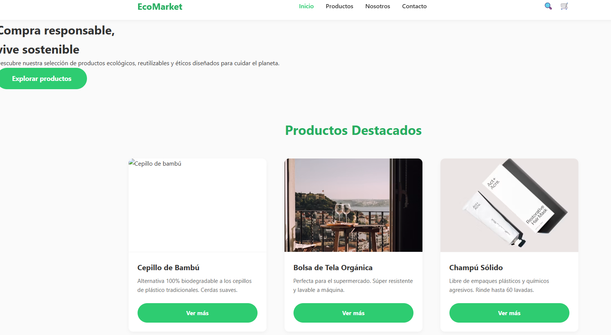

Markdown
# 🌿 EcoMarket - Tienda Sostenible

## 📖 Descripción del Proyecto
EcoMarket es una plataforma web (e-commerce) dedicada a la visibilización y venta de productos ecológicos, reutilizables y sustentables. 

El objetivo de este proyecto es ofrecer una experiencia de usuario (UX/UI) "clean", transmitiendo calma y confianza mediante el uso de paletas naturales y espacios en blanco. Además, representa un reto técnico significativo: **toda la interactividad fue desarrollada utilizando estrictamente HTML5 semántico y CSS3 puro**, sin la intervención de JavaScript ni librerías externas.

## 🚀 Tecnologías y Metodologías Utilizadas
* **HTML5 Semántico:** Estructuración accesible y optimizada.
* **CSS3 Avanzado:**
  * Diseño responsivo mediante **CSS Grid** y **Flexbox**.
  * Enfoque de diseño **Mobile First**.
  * Interactividad sin JS: Implementación de *Checkbox Hack* para menús y botones, `scroll-snap` para carruseles, y validaciones de formularios en tiempo real con pseudo-clases (`:valid`, `:invalid`, `:not(:placeholder-shown)`).
* **Arquitectura de Código:** Aplicación rigurosa de la metodología **BEM** (Block, Element, Modifier).
* **Control de Versiones:** GitFlow y Conventional Commits.

##  Capturas de Pantalla

### Versión Escritorio (Desktop)
> **Nota:** Reemplaza este texto por tu imagen. Puedes tomar un pantallazo, guardarlo en la carpeta `img/` y enlazarlo así: ``

### Versión Móvil (Mobile)
> **Nota:** Reemplaza este texto por tu imagen. ``

## ⚙️ Instrucciones de Visualización Local
Para visualizar este proyecto en tu entorno local, sigue estos pasos:
1. Clona este repositorio: `git clone https://github.com/tu-usuario/EcoMarket_JoseMiguelSandoval.git`
2. Ve al directorio del proyecto: `cd EcoMarket_JoseMiguelSandoval`
3. Abre el archivo `index.html` en cualquier navegador web moderno (Chrome, Firefox, Safari). Alternativamente, puedes usar la extensión *Live Server* en VS Code.

## 🌐 Despliegue en Vivo (Live Demo)
El proyecto ha sido desplegado exitosamente y es accesible desde cualquier dispositivo.
👉 **[Haz clic aquí para ver el proyecto en vivo](ENLACE_DE_TU_PAGINA_AQUI)**

---
**Autor:** Jose Miguel Sandoval Jaimes